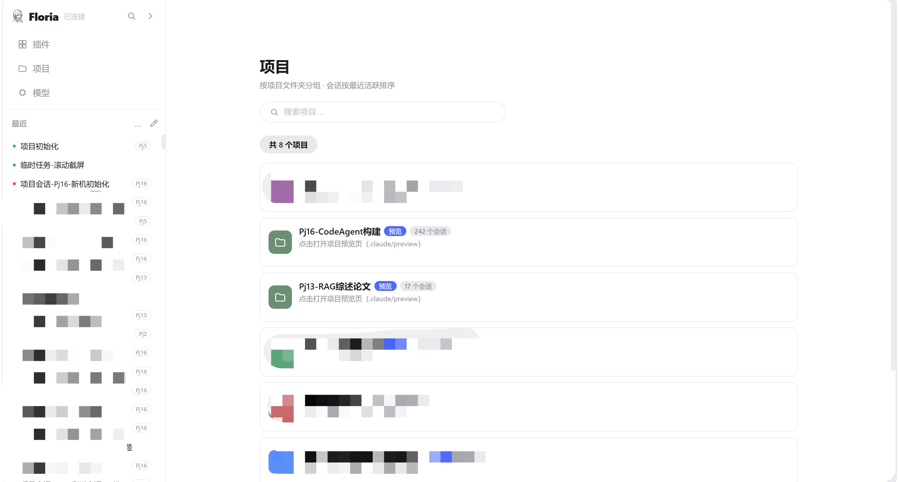
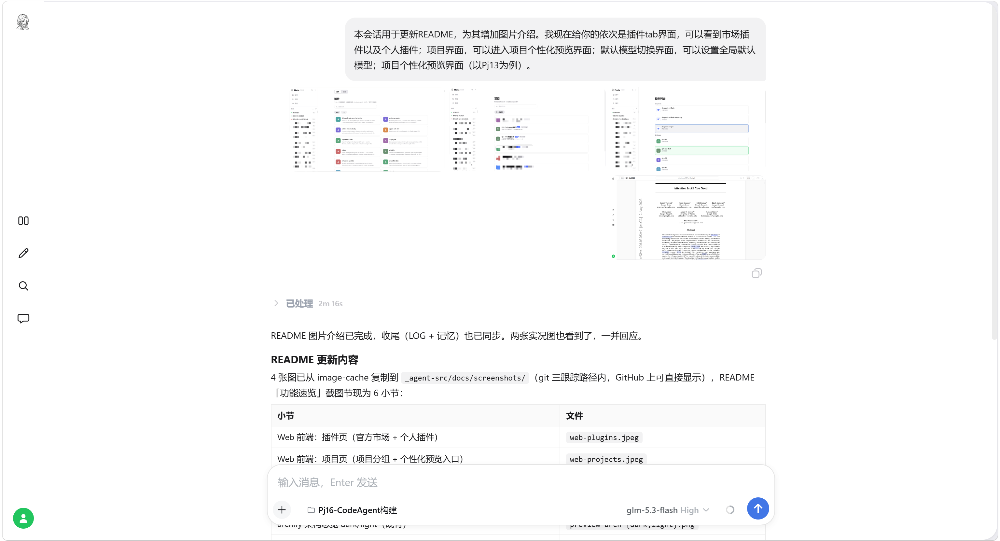
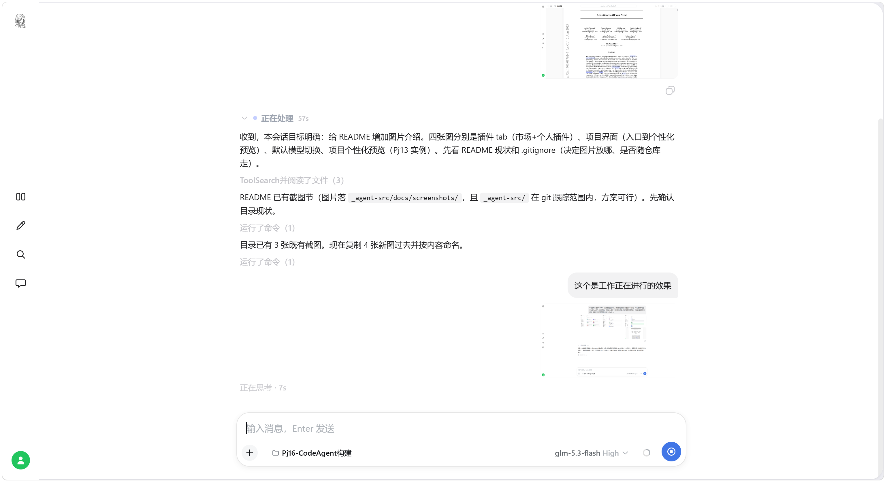
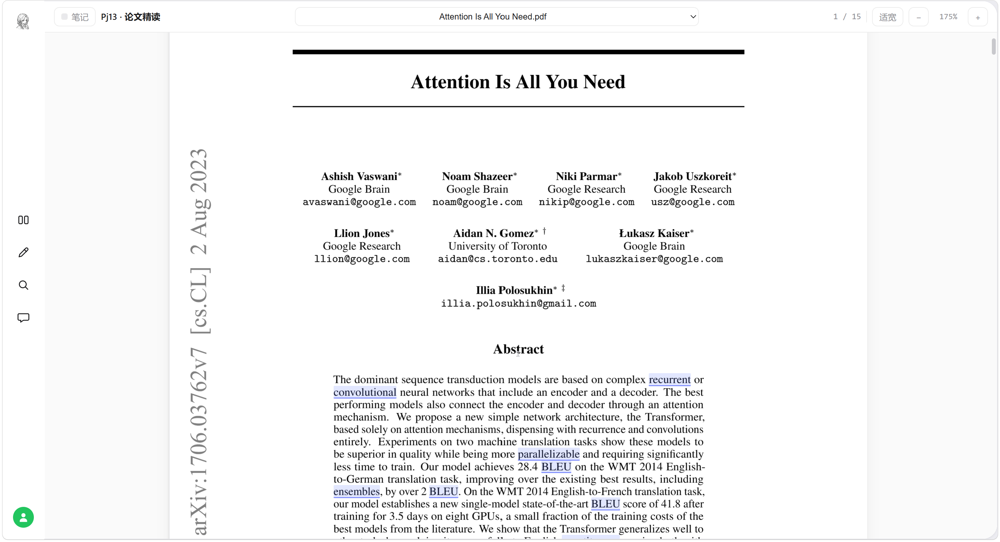

# Floria

便携版 Claude Code fork 的**源码构建区 + 权威标准**所在仓库（原 `Pj16-CodeAgent构建/_agent-src/`，现为独立 git 仓库根，远程 `bruce2431/Floria`）。

## 仓库内容

- `src/` — Claude Code 源码（bun + ink + React，入口 `src/entrypoints/cli.tsx`）；web 前端唯一手改处 `src/gateway/web-src/`，内置网关 `src/gateway/`。
- `scripts/` — 构建与维护入口：`build.ts`（构建 + 编译期 feature 裁剪）、`bundle-web-modules.ts`（前端拼接器）、`gen-web-assets.ts`（资产内联）、`init-neuron-project.ts` / `rebuild-neuron-index.ts`（神经元库维护）。
- `probes/` — 本地探针 `probe-*.ts`（秒级只读验证，`bun probes/probe-X.ts` 直跑）。
- `docs/` — 文档库（索引 `docs/README.md`）：`standards.md`（权威规则）/ `build.md`（构建 + flag 审计）/ `glossary.md`（术语）/ `core.md`（源码核心机制）/ `gateway.md`（网关服务）/ `web-ui.md`（web 链路）；`docs/screenshots/` 界面截图。
- `assets/` — 构建资源；`package.json` / `bun.lock` / `tsconfig.json` / `env.d.ts` — 构建环境。
- `temp/` — 临时产物落点（不入库）。

## 功能速览

- **单文件便携 exe**：`bun build --compile` 自包含单文件（CLI + 内置网关 + web 前端全打包），拷到任意目录运行；便携根标记 `.claude/.claude-portable`（不可移动/删除）让 settings/插件/记忆/凭据跟随 exe 文件夹；裸机首次启动在信任对话框选 yes 即在 exe 旁播种便携根（`maybeInitPortableRoot`）。
- **双等权前端，共同后端**：CLI（React/Ink REPL）与 web（网关静态托管单页）是同一会话引擎的两个等权前端；局域网 iPad/手机访问 `floria.local`（mDNS）远程使用。
- **设备配对授权**：新设备连入时授权门出一次性配对码，PC 端 `/server auth add <配对码>` 完成授权；票证持久化挂域 cookie，换网不重复授权。
- **实时处理折叠**：处理中折叠流式展开旁白/思考/工具步 + 「正在处理」实时计时；回复落地自动收起为「已处理 X」（计时定格），仅保留总结。
- **带图消息全链**：web 端拖拽/粘贴上传图片（一次最多 4 张），气泡内联缩略图 + lightbox 查看；CLI/web 双端渲染一致。
- **远程审批**：CLI 权限弹窗实时中继为 web 审批卡，iPad/手机可远程批准/拒绝，双端竞速先操作者生效。
- **会话间协作**：输入栏 `@` 浮窗或「+」菜单「引用会话」选定目标会话（目录寻址，无授权门），agent 可用 `session_send` 跨会话投递消息；接收侧与本地 user 消息同构落盘、同路入队，气泡外带一行来源灰字。
- **项目个性化预览**：项目产物（架构图/可视化页）落 `<项目>/.claude/preview/`，由网关静态托管，web 项目预览页内直接查看。
- **神经元知识库（NEURON_RAG，默认 feature）**：BGE 本地嵌入 + recall/remember 内置工具 + leiden 社群认知形成链，全链 TS 化进 exe。

## 界面速览

**Web 前端**：插件页（官方市场 + 个人插件）/ 项目页（项目分组，点击进入个性化预览）/ 模型页（全局默认模型切换）。

**会话处理折叠**：处理中流式展示旁白/思考/工具 + 计时；完成后自动收起为「已处理 X」，仅留总结。

**引导消息碎片化交错渲染**：旁白与工具折叠行按线性序交错。

**设备配对授权门**：新设备连入时出一次性配对码。

**项目个性化预览**：产物由 skill 落 `<项目>/.claude/preview/`，网关静态托管 `/preview/<label>/*`，项目页 iframe 直开（无预览回落内置默认主页），远程设备经 `/backend/<label>/` 反代可看。

## 构建与部署

- 命令（在本仓库根目录执行）：`bun install` / `bun run dev`（源码直跑）/ `bun run build:dev`（dev 构建，默认含内置网关，构建与发布统一用本命令）/ `bun run compile`（正式编译 `dist/cli-<ts>.exe`）。
- 产物：dev 构建直出**项目根**（`Pj16-CodeAgent构建/`）`cli-dev-<YYYYMMDDHHMMSS>[-<flag>].exe`，正式编译出 `dist/cli-<YYYYMMDDHHMMSS>.exe`。**带时间戳是强制规范，不允许覆盖**（不设固定名副本）。
- 部署：构建完成即已在项目根，直接用带时间戳的产物 exe 启动，**重启会话/网关进程才生效**（web 前端资源内嵌进 exe，换 exe 即换前端）。
- codegraph 索引：`src/.codegraph/`（相对路径存储），MCP 查询带 `projectPath=Pj16-CodeAgent构建/Floria/src`。

## 版本控制（git）

- 本目录即仓库根，远程 `bruce2431/Floria`；`node_modules/`、`.codegraph/`、`dist/`、`temp/`、`*.exe`、`.env*` 由 `.gitignore` 排除。
- **GitHub Release 发布**：版本号 = exe 内嵌的 dev 版本串（构建自动生成，格式 `2.1.<x>-dev.<日期>.t<UTC时分秒>.sha<HEAD 8 位>`）；流程 = commit+push → 同名 tag → Release（notes 按神经元 LOG 条目主题分组）→ 附对应 exe 为 asset。
