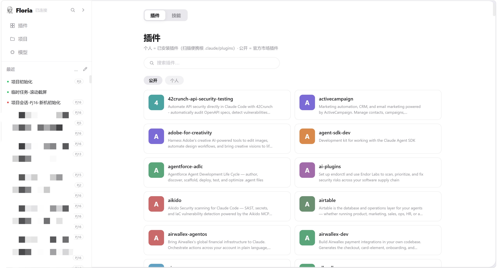
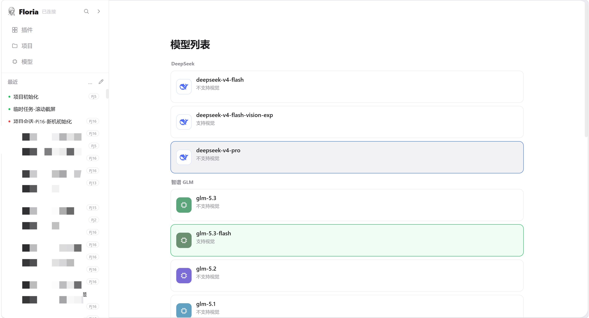
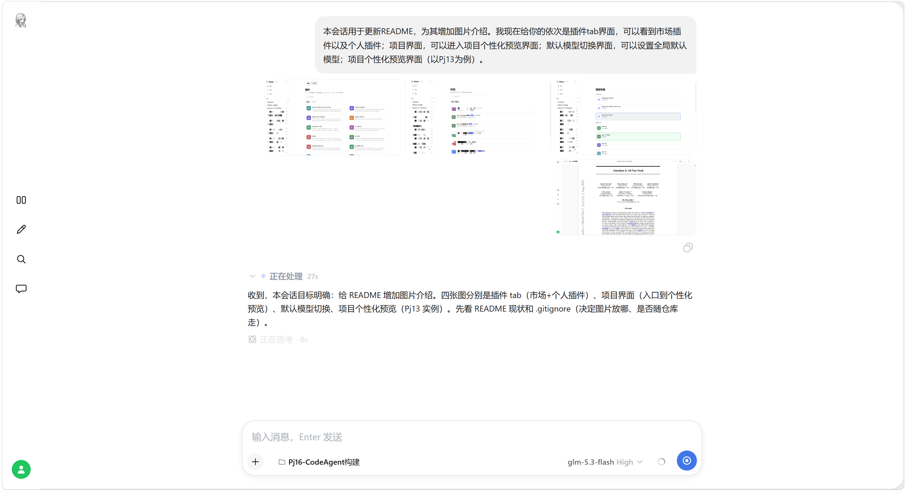

# Pj16-CodeAgent构建

便携版 Claude Code 的源码构建区 + 权威标准所在项目（2026-08-11 全工作区重组后，由原 CODE2431 根目录迁入）。

## 本项目内容

- `_agent-src/` — Claude Code 源码 + 构建环境（`src/`、`scripts/`、`package.json`、`bun.lock` 等），命令在 `cd _agent-src` 后执行。
- `docs/` — 文档库（索引 `docs/README.md`）：`standards.md`（权威规则）/ `build.md`（构建+flag 审计）/ `glossary.md`（术语）/ `core.md`（源码核心机制）/ `gateway.md`（网关服务）/ `web-ui.md`（web 链路）。权威标准见 `@WrokSpace/.claude/CLAUDE.md` 顶部引用。
- `CLAUDE.md` — 项目级 AI 指引（规则+指针型，细节在 `docs/`）；`README.md` — 本文。
- `.claude/neturon/neurons/Neuron-Pj16/` — 项目神经元三层库（`l1.cog` / `l2.mem` / `l3.raw`）。项目 LOG 已迁入 `l3.raw/LOG/LOG.md`（历史存档），**新条目一律写 `l2.mem/mem.db`**（入口 `20260910152816-项目神经元初始化/log_append.ts`），项目根不再有 `LOG.md`。
- `.claude/` — 项目级配置（会话存档 + 跨会话记忆 `projects/memory/`）。
- `SubPj3-角色形象设计/` — 唯一现存子项目（#char 四态图源 + 界面动效 demo）。SubPj1（遥测前端）/SubPj2（私有化网关）实现已并入源码 `src/gateway/web/` 与 `src/gateway/localGateway.ts`，目录已移除。
- `refer/` — 界面设计参考截图。

## 功能速览

- **单文件便携 exe**：`bun build --compile` 自包含单文件（CLI + 内置网关 + web 前端全打包），拷到任意目录运行；便携根标记 `.claude/.claude-portable`（不可移动/删除）让 settings/插件/记忆/凭据跟随 exe 文件夹；裸机首次启动在信任对话框选 yes 即在 exe 旁播种便携根（`maybeInitPortableRoot`）。
- **双等权前端，共同后端**：CLI（React/Ink REPL）与 web（网关静态托管单页）是同一会话引擎的两个等权前端；局域网 iPad/手机访问 `floria.local`（mDNS）远程使用。
- **设备配对授权**：新设备连入时授权门出一次性配对码，PC 端 `/server auth add <配对码>` 完成授权；票证持久化挂域 cookie，换网不重复授权。
- **实时处理折叠**：处理中折叠流式展开旁白/思考/工具步 + 「正在处理」实时计时；回复落地自动收起为「已处理 X」（计时定格），仅保留总结。
- **带图消息全链**：web 端拖拽/粘贴上传图片（一次最多 4 张），气泡内联缩略图 + lightbox 查看；CLI/web 双端渲染一致。
- **远程审批**：CLI 权限弹窗实时中继为 web 审批卡，iPad/手机可远程批准/拒绝，双端竞速先操作者生效。
- **项目个性化预览**：项目产物（架构图/可视化页）落 `<项目>/.claude/preview/`，由网关静态托管，web 项目预览页内直接查看。
- **神经元知识库（NEURON_RAG，feature 门控）**：BGE 本地嵌入 + recall/remember 内置工具 + leiden 社群认知形成链，全链 TS 化进 exe。

## 界面速览

**Web 前端**：插件页（官方市场 + 个人插件）/ 项目页（项目分组，点击进入个性化预览）/ 模型页（全局默认模型切换）。






**会话处理折叠**：处理中流式展示旁白/思考/工具 + 计时；完成后自动收起为「已处理 X」，仅留总结。




**引导消息碎片化交错渲染**：旁白与工具折叠行按线性序交错。


**设备配对授权门**：新设备连入时出一次性配对码。


**项目个性化预览**：产物由 skill 落 `<项目>/.claude/preview/`，网关静态托管 `/preview/<label>/*`，项目页 iframe 直开（无预览回落内置默认主页），远程设备经 `/backend/<label>/` 反代可看。


## 构建与部署

- 命令（在 `_agent-src/` 内）：`bun install` / `bun run dev`（源码直跑）/ `bun run build:dev`（dev 构建，2026-08-25 起默认含内置网关，2026-09-04 起构建与发布统一用本命令）/ `bun run compile`（正式编译 `dist/cli-<ts>.exe`）。
- 产物：dev 构建直出**项目根** `cli-dev-<YYYYMMDDHHMMSS>[-<flag>].exe`，正式编译出 `_agent-src/dist/cli-<YYYYMMDDHHMMSS>.exe`。**带时间戳是强制规范，不允许覆盖**（不设固定名副本）。
- 部署：构建完成即已在项目根，直接用带时间戳的产物 exe 启动，**重启会话/网关进程才生效**（web 前端资源内嵌进 exe，换 exe 即换前端）。
- codegraph 索引：`_agent-src/src/.codegraph/`（相对路径存储），MCP 查询带 `projectPath=Pj16-CodeAgent构建/_agent-src/src`。
- **当前最新构建与逐项变更不在本文累积**——一律见神经元 LOG 层 `.claude/neturon/neurons/Neuron-Pj16/`（09-10 前 `l3.raw/LOG/LOG.md`，其后 `l2.mem/mem.db`）；最新产物看项目根时间戳最大的 `cli-dev-*.exe`（当前 `cli-dev-20260911113010.exe`，sw v306，待实测）。

## 版本控制（git）

- 2026-08-15 git init，远程 `bruce2431/Floria`，**仅跟踪 `_agent-src/`、`README.md`、`docs/` 三个路径**；`CLAUDE.md`/子项目目录/报告 md 等由项目根 `.gitignore` 排除（`.gitignore` 本身不入库），exe 亦不入库。
- **GitHub Release 发布**：版本号 = exe 内嵌的 dev 版本串（构建自动生成，格式 `2.1.<x>-dev.<日期>.t<UTC时分秒>.sha<HEAD 8 位>`）；流程 = commit+push → 同名 tag → Release（notes 按神经元 LOG 条目主题分组）→ 附对应 exe 为 asset。
- 发布记录见神经元 LOG 层。最新：版本 16（2026-09-11，版本主题「前端模块化与实时链根治」，tag `2.1.87-dev.20260911.t033010.sha683ab66c`，asset `cli-dev-20260911113010.exe`）；上版：版本 15（2026-09-10，tag `2.1.87-dev.20260910.t024228.sha37e00c61`，asset `cli-dev-20260910104228.exe`）。

## 新结构速览（便携根 = `@WrokSpace`）

```
@WrokSpace/
├── .claude/              ← 全局配置根（settings/skills/plugins/记忆/会话）
│   └── .claude-portable  ← 便携标记（在配置根内部，不可移动/删除）
├── Pj16-CodeAgent构建/   ← 本项目（源码构建区 + 权威标准）
│   ├── SubPj3-角色形象设计/ ← #char 四态图源 + 界面动效 demo（唯一现存子项目）
│   ├── refer/            ← 界面设计参考截图
│   └── <时间戳>-<名称>/   ← 临时任务目录（发布/验证等，用毕归档 .trash）
└── Pj1-…/Pj17-…/         ← 其他项目
```

## 归档

- 废弃文件按工作区「禁止删除」规则归档到 `@WrokSpace/.trash/YYYY-MM-DD/`。
